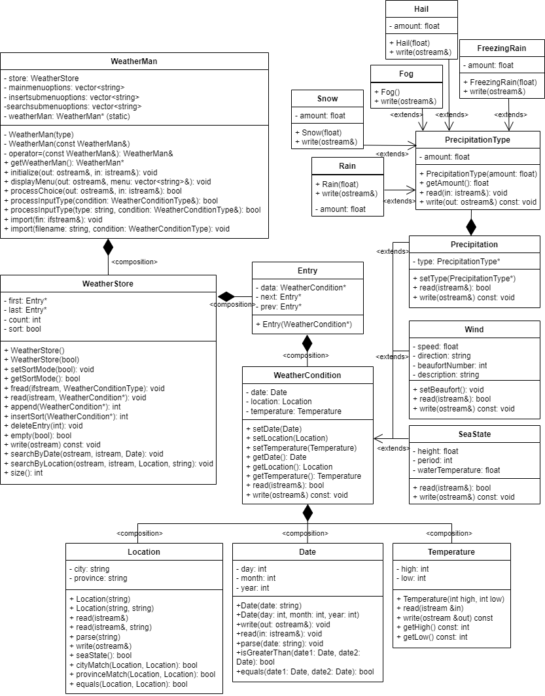

# The Weather Man

TheWeatherMan is a program designed to provide a user-friendly interface for managing and manipulating weather data.

# Table of Contents

- [The Weather Man](#the-weather-man)
- [Table of Contents](#table-of-contents)
- [Project Background](#project-background)
- [High Level Structure](#high-level-structure)
- [Components](#components)
  - [Date](#date)
  - [Location](#location)
  - [Temperature](#temperature)
  - [PrecipitationType](#precipitationtype)
  - [Utils](#utils)
  - [WeatherCondition](#weathercondition)
    - [Precipitation](#precipitation)
    - [Wind](#wind)
    - [SeaState](#seastate)
  - [WeatherStore](#weatherstore)
    - [Entry](#entry)
  - [WeatherMan](#weatherman)
    - [Public Methods](#public-methods)
    - [Private Attributes](#private-attributes)
    - [Why Singleton?](#why-singleton)
    - [Example Usage](#example-usage)
- [Data Formats](#data-formats)
  - [Precipitation](#precipitation-1)
  - [Wind](#wind-1)
  - [Sea State](#sea-state)
  - [All](#all)
- [Menu](#menu)

# Project Background

The proposal for this project is a data storage program that stores weather conditions at
different locations and dates, as well as the temperature for the day. The program will
comprise three child classes, Precipitation, Wind, and SeaState, with one base class,
WeatherConditions. The data will be stored using a doubly linked list and input via a text file or user input via console. The data would be sorted in descending order by the date using an insertion sort algorithm. The user would also be able to search for data, delete data, count the number of entries stored, print all data in the data structure to the screen or print to a text file.

# High Level Structure



# Components

This section aims to describe the components of the project solution using a bottom-up approach.

## [Date](compositions/Date.h)

This class is used to represent a date consisting of a day, month, and year. This class provides functionality for parsing dates from string input, writing dates to output streams, and comparing dates.

This class has two custom constructors:

- `Date(string date)`: Takes in a string in the format `dd/mm/yyyy`. The string is then parsed to extract the integer representation of the day (dd), month (mm), and year (yyyy) which would then be loaded into the corresponding member variables.

- `Date(int day, int month, int year)`: Takes in the integer representation of the day, month, and year of a date and loads it into the corresponding member variables.

This class implements a read function which prompts user for a date input in the format `dd mm yyyy`

This class also implements a write function which prints out a string representation of the date in the format `[dd/mm/yyyy]`

To aid the search function, Date class also implements a set of comparison functions:

- `isGreaterThan`: compares two (2) "dates" for the latest date. "dates" in this sense means instances of the Date class which has a day, month, and year.
- `equals`: checks if two (2) dates are the same.

Read through the [Date.cpp](compositions/Date.cpp) file to find out more about the implementation of the `Date` class.

## [Location](compositions/Location.h)

The `Location` class represents a geographical location with two properties: city and province. This class provides methods to read, write, parse, and compare locations. It also provides a method to determine if a location is a sea state

This class also has two custom constructors:

- `Location(string location)`: Takes in a string representation of a location in the format `City, Province`. The string representation would be parsed to extract the individual data members city and province.

- `Location(string city, string province)`: Takes in the city and province and loads it into the corresponding class variables.

To aid the search function, this class implements two (2) overloads of a read function and a set of comparison functions:

- `read(istream &)`: assumes that the user wants to enter both the city and province

- `read(istream &, string key)`: key can either be `city` or `province`. If `city`, program would assume user wants to only the city and in accordance would assume province as an input for the key `province`. This is useful if searching by either city or province, but not both.

- `cityMatch`: compares two locations for city match.

- `provinceMatch`: compares two locations for province match.

- `equals`: compares two locations for city and provice match.

This class also implements a write function which prints out a string representation of the location in the format `[city, province]`

Read through the [Location.cpp](compositions/Location.cpp) file to find out more about the implementation of the `Location` class.

## [Temperature](compositions/Temperature.h)

The `Temperature` class represents the high and low temperatures of a location.

The Temperature class contains a custom constructor to take in the integer representation of the low and high temperatures.

This class implements a write function which prints out a string representation of the temperature in the format `[low high]`

Read through the [Temperature.cpp](compositions/Temperature.cpp) file to find out more about the implementation of the `Temperature` class.

## [PrecipitationType](compositions/PrecipitationType.h)

This class represents the type and amount of precipitation. It is the base class for `Rain`, `Snow`, `Hail`, and `FreezingRain` which represent the various types of precipitation within the project scope.

- `PrecipitationType(float amount)`: A constructor that sets the amount of precipitation to the given amount.

- `virtual void read(istream &in)`: A function that reads the amount of precipitation from the input stream.

All subclasses override the `write()` function to output their respective precipitation types and amounts (if measureable).

Read through the [PrecipitationType.cpp](compostitions/PrecipitationType.cpp) file to find out more about the implementation of the `PrecipitationType` class.

## [Utils](utils/utils.h)

This is a static class that holds functions that do not belong to a particular class and are used throughout the program. 

Such function is the `toUpper` function which, unlike the standard iostream `toupper` function, takes in a string and converts it to its upper casing representation.

`proofRead`: This function prevents the program from crashing from user input error such as character instead of number. It is used to read integer values from an input stream (e.g. cin) and check if the input is within a certain range. It takes three arguments: an output stream (e.g. cout), an input stream (e.g. cin), and a reference to an integer variable. If the input value is not within the range specified by the lowerbound and upperbound parameters, the function will output a warning message to the output stream.

## [WeatherCondition](WeatherConditions.h)

This class is responsible for representing weather data which includes date, location, and temperature and additional data depending on the weather condition.

This class is the base class for the other types of Weather Conditions including Precipitation, Wind, and SeaState.

It includes the properties of `date`, `location`, and `temperature` along with virtual read and write functions.

### [Precipitation](WeatherConditions.h)

This class extends the `WeatherCondition` class and includes an additional property of [PrecipitationType](#precipitationtype).

The read function of this class calls the read functions of its base class and the PrecipitationType class to set its data via an istream.

### [Wind](WeatherConditions.h)

The Wind class extends the `WeatherCondition` class and includes additional properties of `wind speed`, `direction`, `Beaufort number`, and `description`. Its constructors, takes in the `wind speed`, and `direction`.

The `Beafort number` is set based on the wind speed.

### [SeaState](WeatherConditions.h)

The `SeaState` class extends the `WeatherCondition` class and includes additional properties including wave `height`, `period`, and water `temperature`.

Read through the [WeatherConditions.cpp](WeatherConditions.cpp) file to find out more about the implementation of the `WeatherCondition` classes.

## [WeatherStore](WeatherStore.h)

This class is responsible for storing and managing weather data in a doubly linked list. It contains methods for appending new data, inserting data in sorted order, deleting data, and searching for data by `date` or `location`. The `WeatherStore` class uses the `WeatherCondition` and `utils` class for its implementation.

### [Entry](WeatherStore.h)

The `Entry` class is similar to a `Node` class used for storing WeatherCondition data and creating the doubly linked list structure.

A feature of the `WeatherStore` class is that it allows the user to specify whether data should be sorted or not using the `sort` member variable.

`sort`: If `true`, new entries are inserted in sorted order. If `false` new entries are appended to the end of the list.

Read through the [WeatherStore.cpp](WeatherStore.cpp) file to find out more about the implementation of the `WeatherStore` class.

## [WeatherMan](compositions/WeatherMan.h)

This class is a singleton utility class used to manage weather reports provided using the `WeatherStore` class. This class is responsible for importing, inserting, searching, deleting, and exporting weather data in its `WeatherStore` instance.

It is also responsible for displaying the menu and processing user input.

### Public Methods

- `static WeatherMan* getWeatherMan()`: This method returns a pointer to the `WeatherMan` instance. If no instance exists, it creates one.

- `initialize(ostream& out, istream& in)`: This method prompts the user whether or not they want the data to be sorted.

- `displayMenu(ostream& out, vector<string>& menu)`: This method displays the menu passed in as a parameter.

- `displayMenu(ostream& out, vector<string>& menu)`: This method displays the menu passed in as a parameter.

- `bool processChoice(ostream& out, istream& in)`: This method processes the user's choice from the menu and returns a boolean value indicating whether or not to continue the program.

- `bool processInputType(WeatherConditionType& condition)`: This method prompts the user to choose the type of weather report to be imported and sets the enum `WeatherConditionType` parameter.

### Private Attributes

- `static WeatherMan* weatherMan`: A pointer to the WeatherMan instance. Initialized to NULL.
- `WeatherMan()`: A private constructor.
- `WeatherMan(const WeatherMan&)`: A private copy constructor.
- `WeatherMan& operator=(const WeatherMan&)`: A private assignment operator to prevent copying.

### Why Singleton?

By using a singleton for a utility class, we can ensure that there is only one instance of the class, which can help to reduce memory usage and improve performance. Additionally, a singleton provides a global point of access to the utility class, which makes it easy for other parts of the application to use its methods without having to create their own instances of the class. This can make the code more concise and easier to maintain.

### Example Usage

```c++
#include "WeatherMan.h"

int main() 
{
  WeatherMan *weatherMan = WeatherMan::getWeatherMan();
  weatherMan->initialize(cout, cin);
  while(weatherMan->processChoice(cout, cin));
  cout << "END OF PROGRAM" << endl;
}
```

Read through the [WeatherMan.cpp](WeatherMan.cpp) file to find out more about the implementation of the `WeatherMan` utility class.

# Data Formats

This version of the project solution parses a text file for a specific type of weather condition. Hence, data for different types of Weather Conditions have to be provided in **separate** text files. The format for a single data line in a text for each weather condition type has been provided below:

## [Precipitation](inputs/precipitationInput.txt)

**format description:** `date` `location` `low temperature` `high temperature` `type` `amount`

**format:** `dd/mm/yyyy` `city,province` `low(C)` `high(C)` `type` `amount`

**example:** `25/03/2023` `Halifax,NS` `-1` `2` `rain` `37`

## [Wind](inputs/windInput.txt)

**format description:** `date` `location` `low temperature` `high temperature` `wind speed` `wind direction`

**format:** `dd/mm/yyyy` `city,province` `low(C)` `high(C)` `speed (km/hr)` `direction(degrees)`

**example:** `25/03/2023` `Halifax,NS` `-1` `2` `19` `126`

## [Sea State](inputs/seastateInput.txt)

**format description:** `date` `location` `low temperature` `high temperature` `wave height` `wave period` `water temperature`

**format:** `dd/mm/yyyy` `city,province` `low(C)` `high(C)` `height(m)` `period(s)` `temp(C)`

**example:** `25/03/2023` `Halifax,NS` `-1` `2` `0.5` `2` `7`

## [All](dataassemble.txt)

**format description:** `filepath` `type`

**format:** `filepath` `type(precipitation, wind, sea)`

**example:** `inputs/precipitationInput` `precipitation`

# Menu

The menu provides a list of options that the user can choose from to interact with the WeatherMan program.

On initialization, the user would be asked whether the data imported/inserted should be sorted (sorted by default).

**1. Import**

This option allows the user to import weather data from a file. The user can choose to import data for all weather conditions or for a specific condition, such as precipitation, wind or sea state.

If you choose this option, you would be prompted to enter the report type. You can then enter either `precipitation`, `wind`, `sea`, or `all`.

If you select `all`, you would need to provide a single file that contains a list of the filepath and type of all the files you want to import data from. See the [dataformat](all) for files of type `all`.

`Enter report type:` (precipitation, wind, sea, all)

**2. Insert weather report**

This option allows the user to manually insert weather data for a specific condition, such as precipitation, wind or sea state.

**Reminder:** The date must be entered on a single line in the format `dd` `mm` `yyyy`.

**3. Search Entry**

This option allows the user to search for a specific weather data entry based on different criteria, such as date, city, province, or location.

**4. Delete entry**

This option allows the user to delete a specific weather data entry based on its entry number.

**5. Print state**

This option displays the current state of the program, including the total number of weather data entries and the current sorting settings.

**6. Display**

This option displays all the weather data entries currently in the program.

**7. Export**

This option allows the user to export weather data to a file

**8. Clear Screen**

This option clears the screen to make it easier to read and navigate the program.

**9. Exit**

This option exits the program.
